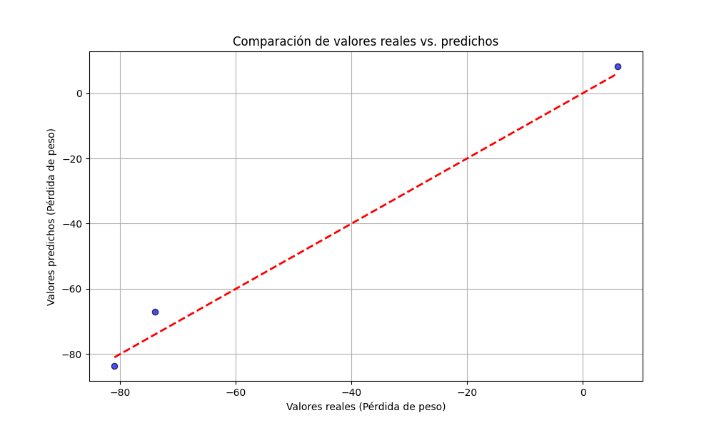

# Informe de Regresión Lineal: Análisis de la Velocidad de Corrosión

Autores: Alexi Caballero, Carlos Quiñonez

## Índice

1.  [Introducción a la Inteligencia Artificial](#1-introducción-a-la-inteligencia-artificial)
2.  [Modelos básicos de IA](#2-modelos-básicos-de-ia)
3.  [Modelo seleccionado: Regresión Lineal](#3-modelo-seleccionado-regresión-lineal)
4.  [Descripción del Experimento y Conjunto de Datos](#4-descripción-del-experimento-y-conjunto-de-datos)
5.  [Significado de la Velocidad de Corrosión y Estado del Arte](#5-significado-de-la-velocidad-de-corrosión-y-estado-del-arte)
6.  [Código del ejercicio](#6-código-del-ejercicio)
7.  [Resultados](#7-resultados)
8.  [Evaluación de los resultados](#8-evaluación-de-los-resultados)
9.  [Discusión de los Resultados](#9-discusión-de-los-resultados)
10. [Conclusión](#10-conclusión)

## 1. Introducción a la Inteligencia Artificial

La Inteligencia Artificial (IA) es un campo de la informática que se centra en la creación de sistemas capaces de realizar tareas que normalmente requieren inteligencia humana. [cite: 1, 2, 3] Estas tareas incluyen el aprendizaje, el razonamiento, la resolución de problemas, la percepción y la comprensión del lenguaje natural. [cite: 2] La IA busca desarrollar algoritmos y modelos que permitan a las máquinas simular la inteligencia humana. [cite: 3]

Su importancia radica en su capacidad para automatizar procesos, analizar grandes cantidades de datos de manera eficiente, mejorar la toma de decisiones y generar nuevas soluciones en diversos campos como la medicina, la ingeniería, las finanzas y la tecnología. [cite: 4]

## 2. Modelos básicos de IA

Existen diversos modelos fundamentales en el campo de la Inteligencia Artificial, entre los que destacan:

- **Aprendizaje Supervisado:** Modelos que aprenden a partir de datos etiquetados, donde se conocen las entradas y las salidas deseadas. [cite: 5] Ejemplos incluyen la regresión lineal, la regresión logística, las máquinas de vectores de soporte (SVM) y los árboles de decisión. [cite: 5, 6]
- **Aprendizaje No Supervisado:** Modelos que aprenden patrones a partir de datos sin etiquetas. [cite: 7, 8] El clustering (como k-means) y la reducción de dimensionalidad (como PCA) son ejemplos comunes. [cite: 7, 8]
- **Aprendizaje por Refuerzo:** Modelos que aprenden a través de la interacción con un entorno, recibiendo recompensas o castigos por sus acciones. [cite: 9, 10] Se utiliza en áreas como la robótica y los juegos. [cite: 9, 10]
- **Redes Neuronales:** Modelos inspirados en la estructura del cerebro humano, compuestos por capas de nodos interconectados. [cite: 11, 12] Son la base del aprendizaje profundo (Deep Learning) y son muy efectivas en tareas complejas como el reconocimiento de imágenes y el procesamiento del lenguaje natural. [cite: 11, 12]

## 3. Modelo seleccionado: Regresión Lineal

En este ejercicio, se ha aplicado un modelo de regresión lineal. [cite: 13, 14] La regresión lineal es un algoritmo de aprendizaje supervisado que busca modelar la relación lineal entre una variable dependiente (o variable objetivo) y una o más variables independientes (o predictoras). [cite: 14, 15] El objetivo es encontrar la línea recta (en el caso de una sola variable independiente) o el hiperplano (en el caso de múltiples variables independientes) que mejor se ajuste a los datos. [cite: 15]

Matemáticamente, la regresión lineal simple se puede expresar como: $\hat{y} = b_0 + b_1x$, donde $\hat{y}$ es el valor predicho de la variable dependiente, $x$ es la variable independiente, $b_0$ es la intersección con el eje y (bias), y $b_1$ es la pendiente (el coeficiente que indica cómo cambia $y$ por cada unidad de cambio en $x$). [cite: 16, 17] El modelo aprende los valores óptimos de $b_0$ y $b_1$ a partir de los datos de entrenamiento. [cite: 16, 17]

En este caso particular, la variable independiente utilizada es el número de 'Days' y la variable dependiente es la 'Weight Loss (g)', que se calcula como la diferencia entre el peso inicial y el peso final del espécimen. [cite: 18, 19] Se busca modelar cómo la pérdida de peso se relaciona linealmente con el tiempo de exposición. [cite: 18, 19]

## 4. Descripción del Experimento y Conjunto de Datos

El conjunto de datos utilizado en este análisis proviene de un experimento diseñado para estudiar la velocidad de corrosión en materiales recubiertos y no recubiertos. A continuación, se detalla el contexto y el contenido del experimento:

- **Contexto:** Se recubrió una varilla metálica con cobre, níquel y cromo mediante la técnica de galvanoplastia. Posteriormente, se comparó la velocidad de corrosión de esta varilla recubierta con la de una varilla metálica desnuda (sin recubrimiento). El objetivo fue evaluar la efectividad del recubrimiento para proteger el metal base contra la corrosión.
- **Contenido:** El experimento se llevó a cabo en un tanque que contenía 2.0 litros de agua de mar sustitutiva, simulando un ambiente marino. Se colocaron en el tanque un espécimen desnudo y un espécimen recubierto, ambos con dimensiones de 22 mm de diámetro y 100 mm de longitud. Los especímenes se mantuvieron en el tanque durante un período de 60 días. Durante este tiempo, se realizaron observaciones de la corrosión a intervalos regulares, y se tomaron fotografías para documentar el proceso.

### Tabla de Datos del Experimento

| Days | Weight of Bare Specimen (g) | Weight of Coated Specimen (g) |
| ---- | --------------------------- | ----------------------------- |
| 0    | 299                         | 293                           |
| 5    | 298                         | 291.8                         |
| 10   | 285                         | 292                           |
| 15   | 277                         | 291.5                         |
| 20   | 265                         | 291                           |
| 25   | 254                         | 290.8                         |
| 30   | 242                         | 290                           |
| 35   | 231                         | 288                           |
| 40   | 229                         | 287                           |
| 45   | 212                         | 286                           |
| 50   | 206                         | 285                           |
| 55   | 202                         | 283                           |
| 60   | 200                         | 282                           |

Los datos recopilados durante el experimento incluyen mediciones del peso de los especímenes a lo largo del tiempo, lo que permite cuantificar la pérdida de material debido a la corrosión. Estos datos se utilizan para analizar cómo el recubrimiento afecta la velocidad de corrosión en comparación con el metal desnudo.

La URL de referencia para este conjunto de datos es: \[Aquí iría la URL si la tuvieras]

## 5. Significado de la Velocidad de Corrosión y Estado del Arte

La velocidad de corrosión es una medida de cuánto material se pierde por unidad de tiempo debido a la corrosión. Es un parámetro crítico en ingeniería y ciencia de materiales, ya que determina la vida útil y la integridad estructural de los componentes. Comprender y predecir la velocidad de corrosión es fundamental para seleccionar materiales adecuados, diseñar sistemas de protección y prevenir fallos catastróficos.

En el estado del arte, la evaluación de la corrosión ha evolucionado desde métodos tradicionales (como la pérdida de peso, que se utiliza en este estudio) hacia técnicas electroquímicas avanzadas, microscopía electrónica, espectroscopía y modelado computacional. Se están aplicando técnicas de machine learning e IA para predecir la corrosión en tiempo real, optimizar recubrimientos y desarrollar materiales resistentes a la corrosión. La capacidad de integrar datos de diversas fuentes y simular escenarios complejos ha mejorado significativamente la precisión y la aplicabilidad de los modelos de corrosión.

## 6. Código del ejercicio

```python
# Importamos las bibliotecas necesarias
import pandas as pd  # Para manejar datos en forma de tablas
import numpy as np  # Para cálculos numéricos
import matplotlib.pyplot as plt  # Para crear gráficos
from sklearn.model_selection import train_test_split  # Para dividir los datos en entrenamiento y prueba
from sklearn.linear_model import LinearRegression  # Para crear el modelo de regresión lineal
from sklearn.metrics import mean_squared_error, mean_absolute_error, r2_score  # Para evaluar el modelo

# Cargamos el conjunto de datos
data = pd.read_csv('corrosion-rate.csv')  # Asegúrate de que el archivo esté en el mismo directorio

# Mostramos las primeras filas del conjunto de datos
print("Primeras filas del conjunto de datos:")
print(data.head())

# Verificamos si hay valores faltantes
print("\\n¿Hay valores faltantes?")
print(data.isnull().sum())

# Eliminamos filas con valores faltantes (si las hay)
data = data.dropna()

# Definimos las variables independientes (X) y la variable dependiente (y)
# Usaremos 'Days' como variable independiente y la diferencia de peso como variable dependiente
data['Weight Loss (g)'] = data['Weight of Bare Sepcimen (g)'] - data['Weight of Coated Specimen (g)']
X = data[['Days']]  # Variable independiente
y = data['Weight Loss (g)']  # Variable dependiente

# Dividimos los datos en conjuntos de entrenamiento y prueba (80% entrenamiento, 20% prueba)
X_train, X_test, y_train, y_test = train_test_split(X, y, test_size=0.2, random_state=42)

# Creamos el modelo de regresión lineal
model = LinearRegression()

# Entrenamos el modelo con los datos de entrenamiento
model.fit(X_train, y_train)

# Realizamos predicciones con los datos de prueba
y_pred = model.predict(X_test)

# Calculamos las métricas de evaluación
mse = mean_squared_error(y_test, y_pred)  # Error cuadrático medio
mae = mean_absolute_error(y_test, y_pred)  # Error absoluto medio
r2 = r2_score(y_test, y_pred)  # Coeficiente de determinación

# Mostramos las métricas en la consola
print("\\nMétricas de evaluación del modelo:")
print(f"Error cuadrático medio (MSE): {mse:.2f}")
print(f"Error absoluto medio (MAE): {mae:.2f}")
print(f"Coeficiente de determinación (R²): {r2:.2f}")

# Generamos un gráfico que compara los valores reales con los valores predichos
plt.figure(figsize=(10, 6))
plt.scatter(y_test, y_pred, color='blue', edgecolor='k', alpha=0.7)
plt.plot([y_test.min(), y_test.max()], [y_test.min(), y_test.max()], 'r--', linewidth=2)  # Fixed range
plt.xlabel('Valores reales (Pérdida de peso)')
plt.ylabel('Valores predichos (Pérdida de peso)')
plt.title('Comparación de valores reales vs. predichos')
plt.grid(True)
plt.show()
```

## 7. Resultados

- Error cuadrático medio (MSE): 20.62
- Error absoluto medio (MAE): 3.98
- Coeficiente de determinación (R²): 0.99

## 8. Evaluación de los resultados

Las métricas de evaluación proporcionan una indicación del rendimiento del modelo de regresión lineal sobre los datos de prueba.

Error cuadrático medio (MSE): 20.62. Este valor representa el promedio de los errores al cuadrado entre los valores reales y los valores predichos. Un valor más bajo indica un mejor ajuste del modelo.

Error absoluto medio (MAE): 3.98. Este valor representa el promedio de las diferencias absolutas entre los valores reales y los valores predichos. Al igual que el MSE, un valor más bajo es deseable.

Coeficiente de determinación (R²): 0.99. Este valor indica la proporción de la varianza en la variable dependiente que es predecible a partir de la variable independiente. Un valor de R² cercano a 1 sugiere que el modelo explica una gran parte de la variabilidad de los datos.



La gráfica muestra la dispersión de los valores predichos en función de los valores reales. Idealmente, los puntos deberían estar cerca de la línea roja discontinua, que representa una predicción perfecta. La dispersión observada indica la magnitud de los errores de predicción.

## 9. Discusión de los Resultados

El modelo de regresión lineal presenta un alto coeficiente de determinación (R² = 0.99), lo que sugiere que el modelo explica una proporción significativa de la variabilidad en la pérdida de peso en función del tiempo. Esto indica una fuerte relación lineal entre las dos variables, lo cual es consistente con la observación de que la corrosión a menudo progresa de manera relativamente constante en ciertos entornos.

Sin embargo, los valores de MSE (20.62) y MAE (3.98) indican la presencia de cierto error en las predicciones. Aunque el R² es alto, estos errores pueden ser importantes en aplicaciones donde la precisión es crítica. Es posible que la linealidad no sea perfecta en todo el rango de datos, o que otros factores (no incluidos en el modelo) influyan en la corrosión.

La gráfica de valores reales vs. predichos confirma visualmente la fuerte correlación, pero también revela la dispersión de los puntos alrededor de la línea de predicción perfecta. Esta dispersión sugiere que el modelo podría beneficiarse de la inclusión de variables adicionales o de un modelo no lineal para capturar mejor la complejidad del fenómeno de corrosión.

## 10. Conclusión

El modelo de regresión lineal aplicado a los datos de pérdida de peso en función del tiempo ('Days') proporciona una buena aproximación de la relación entre estas variables, como lo demuestra el alto valor de R². Esto sugiere que el tiempo es un factor significativo en la predicción de la corrosión, al menos en las condiciones experimentales de este estudio.

No obstante, la presencia de errores (indicados por MSE y MAE) y la dispersión en la gráfica sugieren que el modelo no es perfecto. Para mejorar la precisión, se podrían considerar los siguientes pasos:

Incorporar otras variables: Factores como la temperatura, la concentración del electrolito, el pH y la composición del material podrían influir en la velocidad de corrosión.
Utilizar modelos no lineales: Si la relación entre la pérdida de peso y el tiempo no es estrictamente lineal, modelos como la regresión polinómica o modelos exponenciales podrían ser más apropiados.
Aumentar el tamaño de la muestra: Un conjunto de datos más grande y diverso podría mejorar la generalización del modelo.
En conclusión, aunque el modelo lineal proporciona información valiosa, se recomienda un análisis más exhaustivo para desarrollar un modelo predictivo más robusto y preciso de la corrosión.
